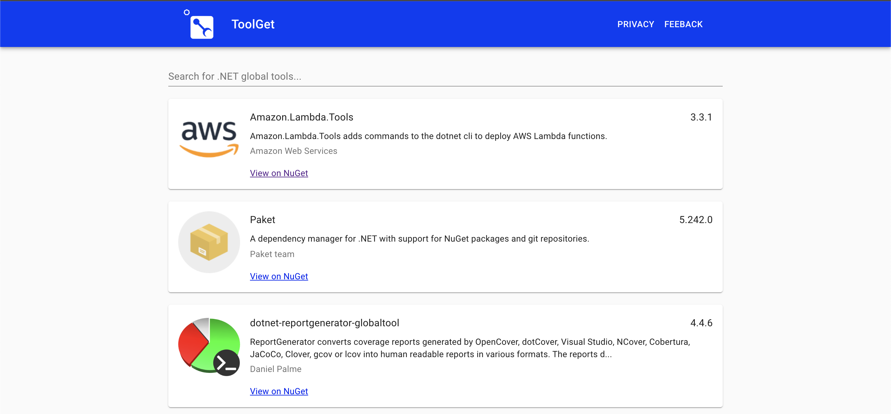

> ToolGet has been archived. To search for .NET Tools, use of the official .NET Tool search experiences from [NuGet.org](https://www.nuget.org/packages?packagetype=dotnettool) or .NET CLI(https://docs.microsoft.com/en-us/dotnet/core/tools/dotnet-tool-search).

Search for .NET Tools from NuGet: https://www.toolget.net

## Get Started

This project uses React and is written in JavaScript, CSS and HTML. You should only need a couple of things to get started:
1. Download and install Node.js LTS from [here](https://nodejs.org/en/download).
2. From command line, run `npm start` to start the react dev server.
3. A browser tab at `http://localhost:3000` will be opened.

## Contributing

Check out the [contributing](CONTRIBUTING.md) page to see the best places to log issues and our code of conduct.

## License

This project is licensed under the [MIT License](LICENSE).
