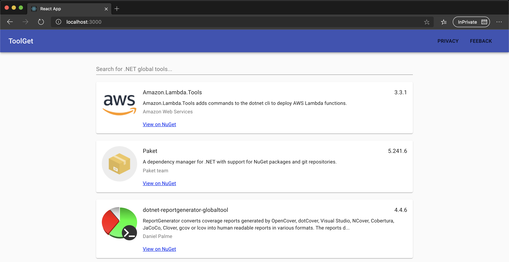

# ToolGet

 Website to search for .NET global tools from NuGet.

 

## Get Started

This project uses React and is written in JavaScript, CSS and HTML. You should only need a couple of things to get started:
1. Download and install Node.js LTS from [here](https://nodejs.org/en/download).
2. From command line, run `npm start` to start the react dev server.
3. A browser tab at `http://localhost:3000` will be opened.

## How to Contribute and Give Feedback

Check out the [contributing](CONTRIBUTING.md) page to see the best places to log issues and our code of conduct.

## License

This project is licensed under the [MIT License](LICENSE).
